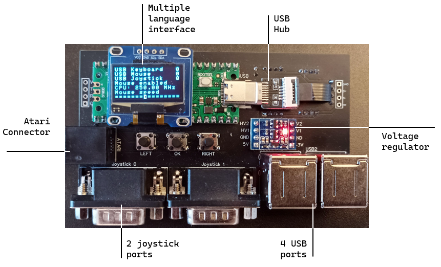
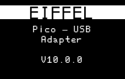
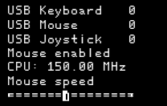
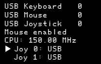
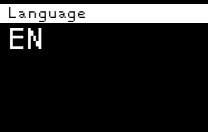
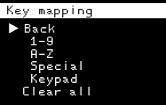

# Atari ST RP2040 IKBD Emulator

This project allows you to use a RP2040 microcontroller to emulate the HD6301 controller that is used as the intelligent keyboard controller for the Atari ST/STe/TT series of computers. This is useful if for example you have a Mega ST that is missing its keyboard. The emulator provides the ability to use a USB keyboard, mouse and joysticks with the ST.

This project has been built specifically for the Raspberry Pi Pico development board but it should be simple to modify it to use any RP2040 based
board that includes a USB host capable connector and enough I/O for the external connections.

The emulator displays a simple user interface on an OLED display. This is entirely optional and you can build a working version without it but
it is certainly useful to show successful connection of your USB devices as well as to allow the mouse speed to be tweaked and to view the data
flowing between the emulator and the Atari ST.

The emulator supports both USB and Atari ST compatible joysticks, supported a maximum of two joysticks at a time. Using the user interface
you can select whether the USB joystick or Atari joystick are assigned to Joysticks 0 and 1.

## How it works
The Atari ST keyboard contains an HD6301 microcontroller that can be programmed by the Atari TOS or by user applications to read the keyboard, mouse and joysticks. The keyboard is connected to the Atari via a serial interface. Commands can be sent from the Atari to the keyboard and the keyboard sends mouse movements, keystrokes and joystick states to the Atari.

Instead of writing code to handle the serial protocol between the Atari and the keyboard, this project provides a full emulation of the HD6301 microcontroller and the hardware connected to it. This means that it appears to the Atari as a real keyboard, and can be customised and programmed by software like a real keyboard, providing maximum compatibility.

The RP2040 USB host port is used to connect a keyboard, mouse and joysticks using a USB hub. These are translated into an emulation of the relevant device and fed into the emulated HD6301 control registers, allowing the HD6301 to determine how to communicate this with the Atari.

## Building the emulator
The emulator is configured as per the schematic below.


All of the external components except the level shifter are optional - you do not need to include the display and buttons if you are happy to hardcode mouse acceleration and joystick assignment settings in code. Also, if you only plan to use USB joysticks then you can omit the DB-9 connectors.

The level shifter is required as the Atari uses 5V logic over the serial connection whereas the Pico uses 3.3V logic. You can possible get away with leaving UART_RX disconnected and connect UART_TX to the Atari without a level shifter but many games and applications will not work like this as they send commands to the IKBD/emulator.atari_ikbd.uf2

## Buying an Atari Eiffel Pico USB device
This project is designed to work with the Atari Eiffel Pico USB device sold on my web store: https://klydes-korner.site/produit/adaptateur-atari-eiffel-pico-usb/



## Compiling the Emulator Firmware

To compile the firmware you will need to checkout this repository, sync the included submodules and make a small change to the pico-sdk CMakelist.txt.

Mac (ARM)  

Compiling on the mac requires xcode, gcc amd armi embedded toolchain. A build can be perfomed with the following commands:

```
# Install GCC components from homebrew
brew install gcc armmbed/formulae/arm-none-eabi-gcc

# Clone the main repo
git clone -b main  https://github.com/klyde2278/atari-st-rpikb
cd atari-st-rpikb

# Sync submodules
git submodule sync
git submodule update --init --recursive

# Build
cmake -B build -S . && cd build && make
```

PC (Linux)
```
#Install GCC
sudo apt install gcc-arm-none-eabi

#Install cmake
sudo apt install cmake

#Clone the main repo in your home folder
git clone --recursive https://github.com/klyde2278/atari-st-rpikb.git

#Update submodules
cd atari-st-rpkib
git submodule update --init --recursive

#From your atari-st-rpikb folder:
mkdir build
cd build

#From the build folder:

cmake ..

#Wait for completion, then type:

make clean && make
```
## Updating the firmware to the Pi Pico
Once compiled, turn your Pi Pico ON while pressing the BOOTSEL button. Upload the atari_ikbd.uf2 file from the Build folder to the Pi Pico folder.

## Downloading the firmware
If you don't know how or can't build the firmware by yourself, please find the released files here: https://github.com/klyde2278/atari-st-rpikb/releases

## Using the emulator
If you build the emulator as per the schematic or buy an Atari Eiffel Pico USB device from me, the Pico is powered directly from the Atari 5V supply. The Pico boots immediately but USB enumeration can take a few seconds. Once this is complete, the emulator is fully operational.

The user interface has several pages that are rotated between by pressing the middle UI button. Since V11.0.0 the emulator features:

1. Splash screen. Shows the version number

   

2. USB Status + Mouse speed. Left and right buttons change allow the mouse speed to be altered.
   
   

3. USB Status + Joystick 0 & Joystick 1 assignment. Middle button selects Joy 1. Left and right buttons toggle between USB joystick and DB-9 joystick.
   
   

The real ST keyboard has a single DB-9 socket which is shared between the mouse and Joystick 0. The emulator allows you to have a USB mouse and a DB-9 joystick plugged in simultaneously but you need to select whether the USB mouse or the DB-9 joystick is active. This can be toggled by using the Ctrl + F12 shortcut on the keyboard any time.

4. Language selection page. Available languages are: English, French, German, Spanish, Italian.

    

5. USB Joystick dead zone settings page. The joystick dead zone can be tested.

   

6. Joystick autofire settings page. An autofire can be set for Atari & USB joysticks.

   

7. Keyboard mapping page. The USB keyboard can be remapped to match the Atari ST keys

   

## Keyboard Shortcuts

The emulator supports several keyboard shortcuts for convenient control:

| Shortcut | Function | Description |
|----------|----------|-------------|
| **Ctrl+F12** | Toggle Mouse Mode | Switches between USB mouse and joystick 0 |
| **Ctrl+F11** | XRESET | Triggers HD6301 hardware reset (like power cycling the IKBD) |
| **Ctrl+F10** | Toggle Joystick 1 | Switches Joystick 1 between D-SUB and USB |
| **Ctrl+F9** | Toggle Joystick 0 | Switches Joystick 0 between D-SUB and USB |
| **Alt+Keypad Plus** | Set 270MHz | Overclocks RP2040 CPU to 270MHz for maximum performance |
| **Alt+Keypad Minus** | Set 150MHz | Sets RP2040 CPU to 150MHz for stability |

For detailed information about keyboard shortcuts, see [KEYBOARD_SHORTCUTS.md](/docs/KEYBOARD_SHORTCUTS.md).

## USB Controller Support

The emulator supports multiple types of USB game controllers:

- **Xbox Controllers**: Xbox 360 (wired/wireless), Xbox One, Original Xbox
- **PS4 DualShock 4**: Full support via USB
- **Generic HID Joysticks**: Standard USB joysticks

Xbox controllers are fully supported using the official TinyUSB XInput driver. D-Pad and left analog stick control movement, A button and right trigger act as fire button.

## Known limitations
The RP2040 USB host implementation seems to contain a number of bugs. This repository contains a patched branch of the TinyUSB code to workaround many of these issues, however there are still some limitations and occasional issues as summarised below:

* Occasionally on startup USB devices are not enumerated. You need to restart the emulator to try again.
* The emulator supports only a single USB hub. So, if you use a keyboard that has a hub built in then that must be connected directly to the Pico and not plugged into another hub.

## Acknowledgements
This project has been pieced together from code extracted from [Steem SSE](https://sourceforge.net/projects/steemsse/). All of the work of wiring up the keyboard functions to the HD6301 CPU is credited to Steem SSE. This project contains a stripped-down version of this interface, connecting it to the Raspberry Pi's serial port.

Steem itself uses the HD6301 emulator provided by sim68xx developed by Arne Riiber. The original website for this seems to have gone but an archive can be found [here](http://www.oocities.org/thetropics/harbor/8707/simulator/sim68xx/).

The code to handle the OLED display is Copyright (c) 2021 David Schramm and taken from https://github.com/daschr/pico-ssd1306.
